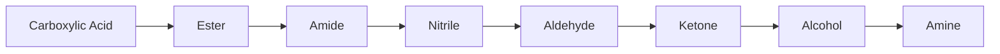
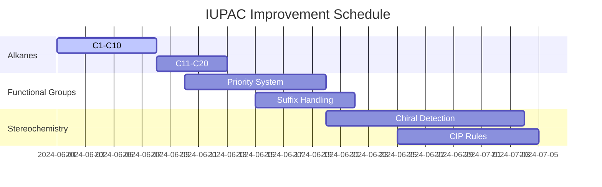

# IUPAC Name Generation Improvement Plan - Milestones 1-3

## Goal 1: Linear Alkanes C1-C20
**Objective:** Perfect naming of straight-chain hydrocarbons  
**Scope:**
- Methane (CH₄) → Icosane (C₂₀H₄₂)
- Handle all constitutional isomers
- Validate against [NIST Chemistry WebBook](https://webbook.nist.gov/chemistry/)

**Implementation Approach:**
1. Enhance chain length detection in `chain-selector.ts`
2. Implement systematic suffix generation:
   ```typescript
   const alkaneNames = [
     'methane', 'ethane', 'propane', 'butane', 
     'pentane', 'hexane', 'heptane', 'octane',
     'nonane', 'decane', 'undecane', 'dodecane',
     'tridecane', 'tetradecane', 'pentadecane',
     'hexadecane', 'heptadecane', 'octadecane',
     'nonadecane', 'icosane'
   ];
   ```
3. Add special case handling for methane/ethane

**Validation:**
- Automated tests for all 20 alkanes
- Cross-check with RDKit's `MolToIUPACName()`

**Success Metric:** 100% accuracy on linear alkanes

---

## Goal 2: Mono-functionalized Compounds (90% Accuracy)
**Objective:** Correct naming of single-FG molecules  
**Priority Order Implementation:**


**Key Components:**
1. **FG Detection** (`functional-group-detector.ts`):
   - Identify exact FG type and position
   - Handle different attachment patterns (terminal/internal)

2. **Suffix Selection**:
   ```typescript
   const suffixMap = {
     'carboxylic acid': 'oic acid',
     'aldehyde': 'al',
     'ketone': 'one',
     'alcohol': 'ol'
   };
   ```

3. **Substituent Ordering:**
   - Alphabetical priority: Bromo > Chloro > Fluoro > Methyl
   - Position numbering from FG end

**Test Cases:**
| Compound              | Expected Name          |
|-----------------------|------------------------|
| CH₃CH₂COOH           | Propanoic acid        |
| CH₃CH₂CH₂NH₂         | Propan-1-amine        |
| CH₃CH(OH)CH₃         | Propan-2-ol           |
| CH₃COCH₂CH₃          | Butan-2-one           |

**Validation Strategy:**
1. 500-compound test set from PubChem
2. Discrepancy logging with `iupac-validator.ts`

**Success Metric:** 90% match rate against reference names

---

## Goal 3: Simple Stereochemistry
**Objective:** Correct R/S descriptors for tetrahedral centers  
**Implementation Phases:**

### Phase 3.1: Configuration Detection
```typescript
// stereo-detector.ts
interface ChiralCenter {
  atomIndex: number;
  neighbors: [number, number, number, number];
  configuration: 'R' | 'S' | 'undefined';
}
```

### Phase 3.2: Priority Rules
1. Atomic number precedence
2. Isotope mass comparison
3. Double-bond expansion (CIP rules)

### Phase 3.3: Name Integration
- Parentheses-enclosed descriptors:  
  `(2R)-2-chlorobutane`

**Validation Compounds:**
```smiles
C[C@H](Br)Cl → (R)-1-bromo-1-chloroethane
C[C@@H](F)OC → (S)-2-fluoropropanol
```

**Edge Cases:**
- Meso compounds (e.g., tartaric acid)
- Pseudo-asymmetric centers

**Success Metric:**  
100% accuracy on isolated chiral centers without rings

---

## Milestone Timeline


## Testing Strategy
1. **Unit Tests:** Per functional module
2. **Integration Tests:** Full name generation pipeline
3. **Golden Tests:** Compare with:
   - RDKit (BSD license)
   - OpenBabel (GPL)
   - OPSIN (MIT license)

**Critical Dependencies:**
1. Complete ring detection (#203)
2. Atomic priority table (#198)
3. Substituent ordering (#215)

> **Note:** All implementations must follow IUPAC Blue Book (2013) guidelines