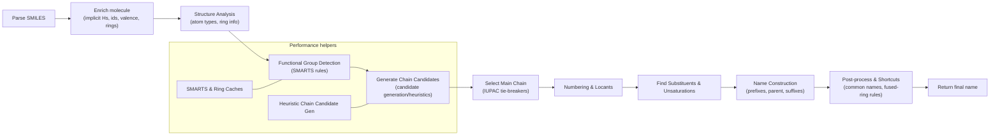

# SMILES → IUPAC Name (Overview)

A concise, non-verbose explanation of how the library converts a SMILES string into an IUPAC name. This is intended to give readers a clear mental model rather than an exhaustive API reference.



## Quick step summary

- Parse SMILES
  - Convert SMILES into a Molecule object (atoms, bonds, basic properties). Typical entry points: `parseSMILES(...)` followed by `generateIUPACName(molecule)`.

- Enrich molecule
  - Add implicit hydrogens, compute atom/bond ids and valence, and detect rings. The enriched molecule is used by SMARTS matching and analysis.

- Structure analysis
  - Derive atom properties (aromatic, degree), ring membership, and other helpers used by naming heuristics.

- Functional-group detection
  - Run SMARTS-based rules to locate principal functional groups and substituents. These detections influence parent selection and suffix choice.

- Chain candidate generation
  - Produce plausible parent chains (carbon-only and heavy-atom candidates). For performance, candidate generation uses heuristics rather than brute-force enumeration for very large molecules.

- Main-chain selection and tie-breakers
  - Apply IUPAC-style priorities: principal functional group precedence, lowest set of locants (unsaturation, heteroatoms, substituents), and OPSIN-like tie-breaks to select the best candidate.

- Numbering & locants
  - Number the chosen parent chain to compute positions (locants) for substituents and unsaturations.

- Substituent & unsaturation handling
  - Detect and classify substituents, collect positions, and compute multiplicative prefixes (di/tri/bis, etc.).

- Name construction
  - Assemble prefixes, parent stem, unsaturation suffixes (`-ene`, `-yne`), and functional-group suffix (e.g., `-ol`, `-oic acid`) using the name constructor and pipeline.

- Post-processing and special cases
  - Apply fused-ring shortcuts, common-name replacements, and fallback formulas. When the standard pipeline cannot produce a suitable name, SMARTS-driven special-case names or formula-based fallbacks may be used.

## Example usage (API sketch)

```ts
import { parseSMILES, generateIUPACName } from 'index';

const parsed = parseSMILES('CC(=O)Oc1ccccc1C(=O)O');
const mol = parsed.molecules[0];
const iupac = generateIUPACName(mol);
console.log(iupac);
```

## Performance notes (short)

- SMARTS matching and chain enumeration are the main hotspots.
- The system uses caching (where present) and heuristics to reduce repeated SMARTS and ring computations for the same molecule.
- For very large molecules, heuristic chain candidate generation is used to avoid combinatorial explosion.

## Where to look for more detail (non-exhaustive)

- High-level generator logic: `src/utils/iupac/iupac-generator.ts`
- Chain candidate & tie-break heuristics: `src/utils/iupac/iupac-chains.ts`
- SMARTS matcher & ring-closure validation: `src/matchers/smarts-matcher.ts`
- Name assembly pipeline: `src/utils/iupac/pipeline.ts`
- Structured name builder: `src/utils/iupac/name-constructor.ts`

## Contributing / extending (brief)

- Add new functional-group SMARTS to the rule engine to support more suffixes. Prefer cheap pre-filters or caching for expensive SMARTS.
- For large-molecule performance improvements, focus on memoizing per-molecule results and limiting chain candidates.
- Add unit and performance tests when changing candidate generation or SMARTS rule sets.

---

This document is intentionally concise — if you want a more detailed developer-oriented doc (file-level details, call graphs, or contributor checklist), I can produce that as a follow-up.
